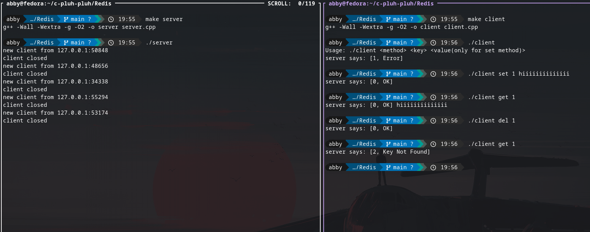

# Redis
This is a Redis server and client implementation where (for now) the data is stored in the STL map data structure of C++ (toy implementation).
Despite that, it works, it works fine.

---

# Usage

1. Build by running `make`
2. Run server in your terminal by `./server`
3. Run the client in another teerminal by `./client`

But (maybe I am little too late if you already ran the client), if you run client like that then  you will be hit by a server error but I have handled that with proper logging
of the usage so you can get the idea from that, rest lemme show the full `./client <method> <key> <value>`

---

# set, get, del
If you've worked with Redis then you may already know about these methods, but if you haven't, no problemo

1. `set <key> <value>` : This method will store the value at specifid key in the storage (in-memory).
  - if you don't know about Key-Value storage then refer [this](https://aws.amazon.com/nosql/key-value/)
  - in-memory is just fancy name for storing in RAM. We do that cuz it's super fast and good for small amount of data.

  I used [FNV](https://en.wikipedia.org/wiki/Fowler%E2%80%93Noll%E2%80%93Vo_hash_function) hash for hashing.

2. `get <key>` : This method just retrieves the value stored at the key. Nothing more, nothing less.

3. `del <key>` : Name already tells it, delete the value at key.

That's all (I made, at least for now).
But hey, even this "simple" thing takes a lot of effort when you think about all the networking & systems programming, software architecture, concurrency models,
POSIX/UNIX APIs, efforts of reading and finding references from the man pages and pfft. Please check out the stuff I did and wrote in my cpp files for deeper insights :)

---

# An example

In my implementation, server shows status code and what is says in the square brackets '[]'

---

# What to excpect next
Even if it's a working project, still a lot of core features and important structures architecure is left to do to make it more speed and performance acer.
[X] Hastables: I've used chaining hashtable (they use nested data structures like array of arrays, array of trees, etc.). Other type of hashtable which I didn't use are
              Open addressing implemented by a single array and use Probing techniques for resolving conflicts.
[] Data Serialization
[] Balanced Binary Tree
[] Sorted Set
[] Timer and Timeout
[] Cache Expirationwith TTL
[] Thread Pool

---

# For the peeps who cared to read this much :D
## A brief description of my intention with this project
I am a CS student who is currently in his B.Tech journey. I am in *2nd year* while marking the start of this project (though I created the readme after 6 commits).
The main goal for me while making this project is to learn **Systems Programming**, **Infrastructure Software** ,**Low Level Instrusive Data Structures**, **Network Programming**
**C/C++** and believe it or not, **Redis**.
I wanted to make this from sratch because I really believe in the quote from Richard Feynman : *"What I cannot create, I do not understand"*.
Another reason which may be really unfamiliar is to avoid the help of AI as much as I can. Although, I do not fully discard it because afterall.. it is still a helpful tool.
But the thing is that many learning developers like me tend to become somewhat dependant on it and don't actually learn stuff that deeply. So, with making this entirely without
the help of AI and taking references from the [Build your own Redis](https://build-your-own.org/redis/#table-of-contents), I have learnt a lot of great stuff and feel really
proud of myself for doing so.
